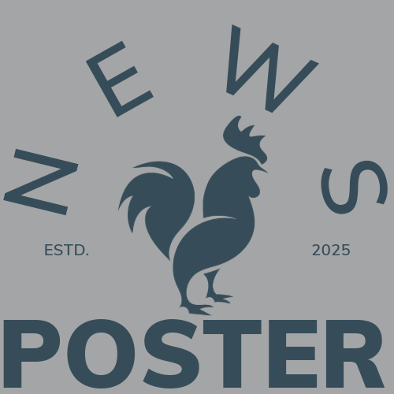

  

# Poster Podcast 🎙️

A modern, minimalist podcast hosting platform built with Flask and WaveSurfer.js. Share your audio content with a sleek, responsive player and real-time waveform visualization.

## Features ✨

- **Beautiful Audio Player**
  - Real-time waveform visualization
  - Custom playback controls
  - Audio processing with bass boost and effects
  - Volume adjustment and time tracking

- **Social Features**
  - Like and share podcasts 
  - Embed players on other websites
  - View count tracking
  - Social media share previews
  - Time-ago timestamps

## Tech Stack 🛠️

- **Frontend:**
  - HTML5/CSS3
  - TailwindCSS
  - WaveSurfer.js with audio visualization
  - Vanilla JavaScript

- **Backend:**
  - Flask (Python)
  - SQLAlchemy ORM
  - PostgreSQL database
  - Cloudinary media storage
  - OAuth2 for social integrations

## Contributing 🤝

Contributions are welcome! Please feel free to submit a Pull Request.
